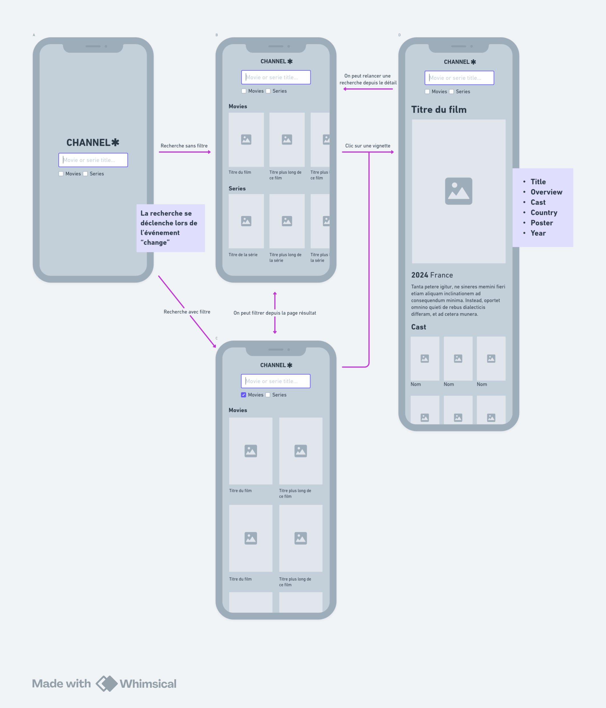
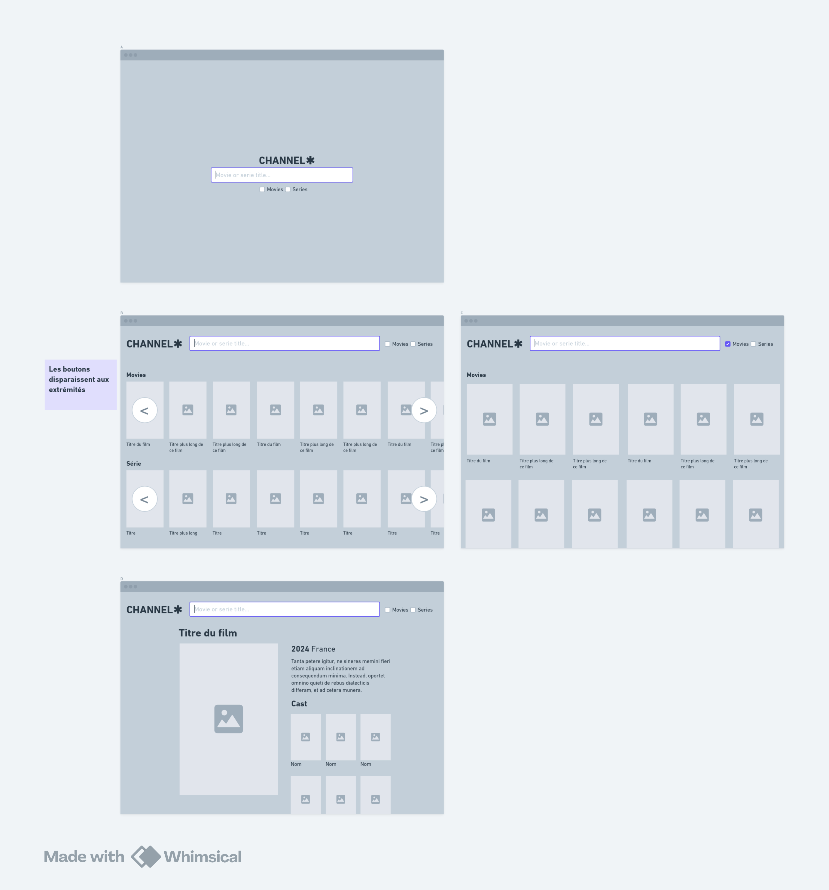

# Channel Multiply

Production url https://channelmultiply.surge.sh 

Project kanban https://github.com/users/alexis-20cent/projects/4 (scroll to the right if needed)

## TL;DR

Launch project in a container

```sh
docker-compose build --no-cache
docker-compose up -d     
docker ps # pick the id of canal-multiply
docker exec -it <id> sh 

yarn
yarn dev
```

Or launch directly

```sh
yarn
yarn dev
```

## More details

- [Documentation](https://docs.channelmultiply.surge.sh/)
- [Storybook](https://story.channelmultiply.surge.sh/)

_You will have a security alert, but you can trust me ;)_


## 1. Project explaination

- [1.1 About the architecture](#anchor-11)
- [1.2 Tools & dependencies](#anchor-12)
- [1.3 React usage](#anchor-13)
- [1.4 Documentation](#anchor-14)
- [1.5 Error reporting](#anchor-15)
- [1.6 Docker usage](#anchor-16)
- [1.7 Boilerplate code generation](#anchor-17)
- [1.8 Tests](#anchor-18)
- [1.9 CI/CD](#anchor-19)

## 2. Project management

- [2.1 User stories](#anchor-21)
- [2.2 Kanban](#anchor-22)
- [2.3 Wireframes](#anchor-23)
- [2.4 Retrospective](#anchor-24)
- [2.5 Branches & pull requests](#anchor-25)

<a name="anchor-11"></a>

### 1.1 Aboout the architecture

This project is organized according to some concepts from the hexagonal architecture.  
The main reason of this choice is that so our application can grow without us losing control.  
Moreover it allows us to not be dependant on our framework so that we can handle the evolutions, as our project is designed to grow and evolve year after year.

Here is the folder organization

```sh
.
├── .generator/ # a PoC demonstrating we can build a tool to generate our boilerplate code, should be packaged alone in the future
├── .github/ # contains our workflows for ci/cd with github actions
├── .storybook/ # some files to our components documetation
├── e2e/ # our e2e test
├── public/ # some static files used in our application
├── src/ # our development code
│   ├── components/ # contains generic components
│   │   ├── sections/ # for generic components that are related to our application data
│   │   └── shared/ # for  the most reusable components, thanks to their own props; they must never import components from outside this folder, they may be packaged alone
│   ├── contexts/ # for react generic contexts
│   ├── hooks/ # for generic react hooks
│   ├── modules/ # we split our code by entities, each entity will have its own domain and its own infrastructures
│   │   ├── actors/ # our application deals with actors, everything related to that should be there
│   │   ├── contents/ # series and movies share many things, all of that is in here
│   │   ├── movies/ # everything specific to movies
│   │   ├── series/ # everything specific to series
│   │   ├── someEntity/ # we could have more and more entities, each of them could have what is next
│   │   │   ├── domain/ # The definition and logic of our entity, totally abstracted from our framework, must never import infrastructures
│   │   │   │   ├── Entity.ts # The type definition of our entity and verification
│   │   │   │   └── EntityRepository.ts # The interface shaping what we can do with our entity
│   │   │   │   └── ... # we could have some more business related to our entity
│   │   │   └── infrastructure/ # connectors that connect our domain with the outside world
│   │   │       ├── components/ # we could display data in our interface
│   │   │       ├── hooks/ # we could organize our rerender strategy and effects in react hooks
│   │   │       ├── TMDB/ # we could get data from external resources, here the movie database
│   │   │       │   ├── client.ts # clients are there to fetch data from external resources
│   │   │       │   ├── dto.ts # dtos are there for giving the shape of this external data
│   │   │       │   ├── mapper.ts # mappers are there to map dto to our domain entity
│   │   │       │   └── repository.ts # infrastructure repositories are there to implement domain repository
│   │   │       └── ... # we could have other things to connect with
│   │   └── ... # we could have more and more entities
│   ├── styles/ # for global styles, specific styles must be with their associated components
│   └── utils/ # for global utility stuff
│       ├── clients/ # like factories for building clients
│       └── helpers/ # or reusable helper functions
└── tests/ # for tests with vitest and testing library
```

Here are some examples of the benefits given by this architecture.  
The first one will show the advantage of repositories and dependency injection

```tsx
// src/modules/contents/infrastructure/hooks

// here we use currying to achieve dependency injection
// so that we are able to perform search from any Repository that implements our interface

// in the application we use the TMDB repository stored in our context to perform the search 
// but we can also imagine a different context in a repository that get fake data so that we can test our application

function createUseSearch<T extends Content>(repository: ContentRepository<T>) {
  return function(search: string, onSuccess: (results: T[]) => void) {
    const cleanSearch = search.trim();

    useEffect(() => {
      (async() => {
        if (cleanSearch) {
          try {
            const data = await repository.search(cleanSearch);
            onSuccess(data);
          } catch (error) {
            console.error(error);
          }
        } else {
          onSuccess([]);
        }
      })();
    }, [cleanSearch, onSuccess]);
  };
}

```

Another good example is the use of mappers of dto.  
In our domain Serie and Movie are quite the same.  
But in TMDB some of their fields are different.  

```ts
type Movie = Content & {};
type Serie = Content & {};

// they have properties of Content
type Content = {
  id: number,
  title: string,
  image?: string | null,
  description?: string | null,
  year?: string | null,
  countries?: string[] | null,
  actors?: Actor[] | null,
}; 
```

But in TMDB they have differents fields. So we define DTOs to give the shape of this fields.
Have a look at the title and you'll see that the countries or the date look different.

```ts
type MovieTMDBDTO = {
  id: number,
  title: string,
  poster_path?: string,
  overview?: string,
  success?: boolean,
  production_countries?: Array<{ name: string }>,
  release_date?: string,
};

type SerieTMDBDTO = {
  id: number,
  name: string,
  poster_path?: string,
  overview?: string,
  success?: boolean,
  origin_country?: string[],
  first_air_date?: string,
};
```

So we just define mappers taking a DTO in input and giving our Movie or our Serie in output

```ts
const mapTMDBDTOToMovie = (dto: MovieTMDBDTO): Movie => {
  return {
    id: dto.id,
    title: dto.title,
    image: dto.poster_path,
    description: dto.overview,
    countries: dto.production_countries?.map(country => country.name),
    year: dto.release_date?.split('-')[0],
  };
};

const mapTMDBDTOToSerie = (dto: SerieTMDBDTO): Serie => {
  return {
    id: dto.id,
    title: dto.name,
    image: dto.poster_path,
    description: dto.overview,
    countries: dto.origin_country,
    year: dto.first_air_date?.split('-')[0],
  };
};
```

We use this mappers after fetching our data in our repositries

```ts
get(id) {
	const serieDTO = await serieTMDBClient.get('/' + id);
	if (typeof serieDTO.success === 'boolean' && !serieDTO.success) {
		throw new Error('Serie not found');
	}
	const serie = mapTMDBDTOToSerie(serieDTO);
	serie.actors = await this.getActors(id);
	return serie;
}
```

So that both our Series and our Movies are Contents.  
We can use Content components to avoid code duplication.

```tsx
// can be used for a serie or a movie since they both have a title thanks to our mappers
<Section title={content.title} className='content' />

// ...
```

So even if the folder architecture might look heavy at first sight,  
we can see that this architecture will give us a lot of benefits 
- to avoid deep dependency with our framework
- to test our code more easily
- to avoid code duplication
- to avoid the lost of control over the course time

<a name="anchor-12"></a>

### 1.2 Tools & dependencies

Several tools in this project make team work easier and help developers.

#### Eslint

Eslint will help the team to follow the same code styles.  
In this project, the configuration extends `neostandard` styling rules. This fork of the `standard` rules is compatible with the last version of eslint.  
You can launch lint with `yarn lint` or `yarn lint:types` to launch tsc at the same time.
This operation will also happen on each PR you will do on `develop`.  
Config is located in `.eslint.config.js`

#### Vite

Vite is our building tool. It gives us a development server by running `yarn dev`.  
To have our production code we run `yarn build`.  
Config is located in `vite.config.ts`.  
A resolver `'@/'` is configured so that you can make your `import` from `src/`.

#### Sass

To write css more efficiently we have to use SASS in this project.  
We use CSS native variables most of the time since we can interact with it at runtime.  
But we also have sass tools:

```scss
// _vars
$small: 30rem;
$medium: 40rem;
$large: 60rem;

@mixin mq($min: $large){
	@media screen and (min-width: $min){
		@content;
	}
}

// anywhere
@use '@/styles/vars' as *;

.item {

	&-child {
		font*size: 1em; // .item-child will appear smaller on a smaller screen,

		@include mq { // mq does a media query in mobile first style, and its default value is large,
			font-size: 2em; // bigger on a larger screen
		}
	}

}
```

We use BEM convention with a simple hyphen `-` for elements and double `--` for modifier

```scss
.block
.block-element
.block-element--modifier
```

#### Libraries

In addition to our dev dependencies we use project dependencies. We use React and ReactDOM to describe our user interface and render it in DOM.  
We also use React Router DOM which makes it easy to get relevant URL and deal with URLParams accross the navigation while keeping our history up to date.  
We don't use a lot of dependencies to not be too dependent on it. We use only robust and efficient depencies and develop what we specifictly need.

<a name="anchor-13"></a>

### 1.3 React usage

We have 3 types of components in our project

- Components related to our entities located in modules infrastructures
- Components of our design system located in `components/shared`. They intend to be very parametrable and totally agnostic. They are documented in our storybook.
- Components linking and presenting them or connecting ui with data are in `components/sections`

We use custom hooks to avoid mixing presentation and data or effect logic in our components.

We use a react context to provide global data to our application.

<a name="anchor-14"></a>

### 1.4 Documentation

We have an autogenerated documentation with `typedoc`.  Build with `yarn doc` and preview with `yarn doc:preview`. Or visit https://docs.channelmultiply.surge.sh/ to see the last production generation. It can be helpful to find types definitions. 
If you write a complex function, you can annotate it with `/**` two asterisks comments and visit [typedoc](https://typedoc.org/guides/overview/) to learn more about tags.

We also have a storybook to present our presentational components. It shows you props and their result.  
Launch `yarn storybookr` or visit https://story.channelmultiply.surge.sh/  
For example you will see that `List` has a `scrollable` props to be rendered as a classic vertical list or a scrollable horizontal list.  
You will also see that this component can be rendered as a semantic element with the `as` prop or accept common props.

<a name="anchor-15"></a>

### 1.5 Error reporting

Sentry is configured to record errors and gives us the ability to know what errors our users are facing in production.

<a name="anchor-16"></a>

### 1.6  Docker usage

A simple docker image is present to build a container using node `20.18.0`. So that all of the team can have the same version of node for this project. This is the same version used to build in production so that we avoid surprises.  
Different ports are exposed to allow us to access both development server, storybook, typedoc and build preview.  

To use it

```sh
docker-compose build --no-cache # build image from Dockerfil
docker-compose up -d # launch a container   
docker ps # pick the id of canal-multiply
docker exec -it <id> sh # enter in our container in interactive mode
# you can then use our yarn commands
```

<a name="anchor-17"></a>

### 1.7 Boilerplate code generation

We have some repetitive structures in our modules. A proof of concept can be launched with `yarn generate:module` that launches a terminal interface to generate our boilerplate code. It will make us gain a lot of time. This should be packaged outside the projet to have its own architecture and dependencies.  
We can imagine just typing the type of our domain entity and have all the validators automatically generated according to the type definition.  
It is build with the package `inquirer`.

<a name="anchor-18"></a>

### 1.8 Tests

We have `vitest` configured in this projets so that we can easily write unit tests. Launch with `yarn test`.  
You can check a coverage report with `yarn coverage`. Actually the coverage should be improve but the first effort was to produce a MVP.  
In addition we have `@testing-library/react` to allow us to test our components.  

We also have e2e tests with playwright. It should be used to check our tests cases defined in our issues on github. Actually just one test is written to demonstrate the goal. 

<a name="anchor-19"></a>

### 1.9 CI/CD

Github action is configurer in `.github/.workflows`.  
It launches tests and linting on PR and merge on `develop` and `master`.  
E2E tests are performed on PR and merge request on `master`

We also have deployment action that will upload our build on `surge.sh`, a free frontend host.  
It will be at https://channelmultiply.surge.sh 

<a name="anchor-21"></a>

### 2.1 User stories

We have 2 epics [defined here](`https://github.com/alexis-20cent/Channel-Multiply/milestones`)

They contain our user stories [listed here](https://github.com/alexis-20cent/Channel-Multiply/issues?q=is%3Aissue+) as github issues

[Here is an example](https://github.com/alexis-20cent/Channel-Multiply/issues/2) in which you can see that each of them is split in tasks to help developper to identify his work. Needed informations such as api endpoints or wireframes are given. Tests cases are there also to help the team to know what is the goal.

<a name="anchor-22"></a>

### 2.2 Kanban

These user stories are our backlog. They are organized in our [poject kanban](https://github.com/users/alexis-20cent/projects/4).  
Tags are there to help us to know the sprint, the size, the epic, the priority or the assignee for each user storie.

The roadmap is also [available here](https://github.com/users/alexis-20cent/projects/4/views/4).

<a name="anchor-23"></a>

### 2.3 Wireframes

<details>
	<summary>
		Expand to watch the wireframes
	</summary>




</details>

<a name="anchor-24"></a>

### 2.4 Retrospective

To prepare the next retrospective each member of the team can take notes [on the board here](https://github.com/users/alexis-20cent/projects/5).  
This will help us getting better.

<a name="anchor-25"></a>

### 2.5 Branches & pull requests

For each user story a branch is created and we work on it.  
Each pull request is made on develop.  
When we have enough features that need to be launched in production, a pull request is made from develop to master.  
Some hotfixes can be made from a specific branch with a merge request directly to master.
